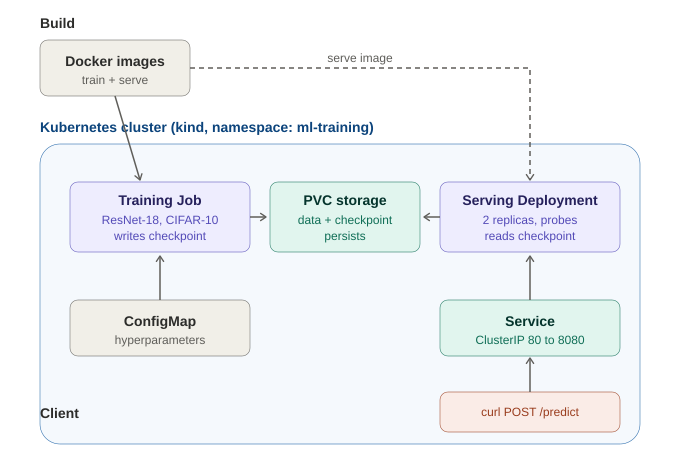

# mlops-pytorch-pipeline

End-to-end deployment of a PyTorch image classifier (CIFAR-10) through the full
MLOps lifecycle: local development with Git workflows, containerized training and
serving with Docker, and orchestrated deployment on Kubernetes.


---

## Architecture



The pipeline separates **training** from **serving**, connected by a shared
persistent volume:

- A **Kubernetes Job** runs the training container, reads hyperparameters from a
  **ConfigMap**, and writes the trained model checkpoint to a **PersistentVolumeClaim (PVC)**.
- A **Deployment** (2 replicas) runs the serving container, mounts the same PVC
  read-only, loads the checkpoint, and answers predictions.
- A **Service** (ClusterIP) exposes the serving pods; an **HPA** (Horizontal POD Autoscaler) scales them on CPU load.

Training and serving never run at the same time — the checkpoint persists on the
PVC between them, which is what decouples the slow, one-time training from fast,
repeatable inference.

---

## Project structure

```
mlops-pytorch-pipeline/
├── README.md
├── .gitignore
├── .github/workflows/ci.yml
├── src/
│   ├── model.py          # CIFAR-adapted ResNet-18 factory
│   ├── dataset.py        # CIFAR-10 loaders + transforms
│   ├── train.py          # config-driven training loop, JSON logs, early stopping
│   └── serve.py          # Flask inference server (/predict, /health)
├── configs/
│   └── training_config.yaml
├── docker/
│   ├── Dockerfile.train  # multi-stage training image
│   └── Dockerfile.serve  # slim, non-root serving image with HEALTHCHECK
├── k8s/
│   ├── namespace.yaml
│   ├── configmap.yaml
│   ├── pvc.yaml
│   ├── training-job.yaml
│   ├── serving-deployment.yaml
│   ├── serving-service.yaml
│   └── hpa.yaml
├── requirements/
│   ├── train.txt         # pinned training deps
│   └── serve.txt         # pinned inference-only deps
└── tests/
    └── test_model.py
```

---

## Model & results

The model is a **ResNet-18 adapted for CIFAR-10**: the stock 7×7 stride-2 stem
plus maxpool (designed for 224×224 ImageNet images) is replaced with a 3×3
stride-1 conv and the initial maxpool removed, so 32×32 CIFAR images aren't
downsampled away before feature extraction.

Two training paths were used:

| Path | Environment | Epochs | Best val accuracy |
|------|-------------|--------|-------------------|
| GPU training | Google Colab (T4) | 10 | **88.05%** |
| In-cluster Job | kind (CPU, local) | 10 | **86.96%** |

The **Colab GPU run** was used to produce a model quickly (~9 minutes vs. an
estimated 4–5+ hours on CPU) — the standard MLOps practice of offloading
compute-heavy training to a GPU. This was the only way to check the GPU training
time for this model. This was used as a baseline to compare with the **in-cluster Job** 
which demonstrates that the Kubernetes training pipeline works end-to-end on real data,
producing a comparable model. The model took about 20hours to train on CPU (2 cores).
The serving layer serves the in-cluster checkpoint, keeping the entire
train-and-serve flow inside Kubernetes.

---

## Setup

### Software

- Python 3.11
- Docker Desktop
- `kubectl` and `kind`


### Clone

```bash
git clone https://github.com/lakshman-gitcode/mlops-pytorch-pipeline.git
cd mlops-pytorch-pipeline
```

### Local Python environment (for tests / local runs)

```bash
python3.11 -m venv .venv
source .venv/bin/activate
pip install --upgrade pip
pip install -r requirements/train.txt
pip install flask pillow pytest  
```

Run the tests:

```bash
pytest tests/ -v
```

---

## Part C: Docker

Build both images:

```bash
docker build -f docker/Dockerfile.train -t mlops-train:v1 .
docker build -f docker/Dockerfile.serve -t mlops-serve:v1 .
```

Run training locally (mounted volumes for data and checkpoints):

```bash
mkdir -p data checkpoints
docker run --rm \
  -v $(pwd)/data:/app/data \
  -v $(pwd)/checkpoints:/app/checkpoints \
  -e SUBSET=500 \
  mlops-train:v1
```

Run serving locally and test:

```bash
docker run --rm -d -p 8080:8080 \
  -v $(pwd)/checkpoints:/app/checkpoints \
  mlops-serve:v1
curl http://localhost:8080/health
curl -X POST http://localhost:8080/predict -F "image=@test_image.png"
```

**Image optimization:** using CPU-only PyTorch wheels
(`--extra-index-url https://download.pytorch.org/whl/cpu`) reduced the training
image from **8.12 GB to 1.37 GB** (~83% smaller) by excluding CUDA libraries the
CPU deployment never uses.

---

## Parts D–F: Kubernetes

### Create the cluster and load images

```bash
kind create cluster --name mlops
kind load docker-image mlops-train:v1 --name mlops
kind load docker-image mlops-serve:v1 --name mlops
```

### Part D: training Job

```bash
kubectl apply -f k8s/namespace.yaml
kubectl apply -f k8s/configmap.yaml
kubectl apply -f k8s/pvc.yaml
kubectl apply -f k8s/training-job.yaml

kubectl get pods -n ml-training -w
kubectl logs -n ml-training -l app=model-training -f
```

The Job mounts the ConfigMap at `/app/configs` and the PVC at `/app/data` and
`/app/checkpoints` (via `subPath`), trains, and writes the checkpoint to the PVC.

### Parts E & F: serving + validation

```bash
kubectl apply -f k8s/serving-deployment.yaml
kubectl apply -f k8s/serving-service.yaml
kubectl apply -f k8s/hpa.yaml

kubectl get pods -n ml-training
kubectl get deployment model-serving -n ml-training
kubectl get svc model-serving -n ml-training

# test the prediction endpoint
kubectl port-forward svc/model-serving 8080:80 -n ml-training
# in another terminal:
curl http://localhost:8080/health
curl -X POST http://localhost:8080/predict -F "image=@test_image.png"
```

The serving pods become `READY` only once the readiness probe gets a 200 from
`/health`, which happens after the model finishes loading from the PVC.

---

## Configuration

Training is driven by `configs/training_config.yaml` (or the ConfigMap in k8s):

```yaml
model:
  architecture: resnet18
  num_classes: 10
training:
  epochs: 10
  batch_size: 64
  learning_rate: 0.001
  early_stopping_patience: 3
  subset: 0            # 0 = full dataset; >0 trains on a subset (fast smoke-tests)
data:
  dataset: cifar10
  data_dir: /app/data
output:
  checkpoint_dir: /app/checkpoints
  model_name: classifier_v1.pt
```

`train.py` reads its config path from the `TRAINING_CONFIG` environment variable,
falling back to `/app/configs/` (k8s/Docker) or `configs/` (local).

---

## Git workflow

Work followed a `feature/* → develop → main` branching model, with each feature
merged via a Pull Request with a meaningful description, using Conventional
Commits (`feat:`, `fix:`, `chore:`, `test:`, `docs:`).

---

## Constraint

The main constraint were the CPU cores for training. We used only 2 cores and the 
training took around 20 hours to complete. 4gb RAM allocated was never fully utilised
and the bottleneck was only the CPU cores. 
